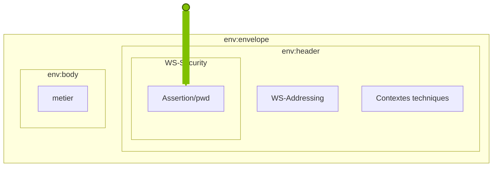

# **2 assertions** 

## **Assertion Vitale**
## **Assertion PS**

```mermaid
graph TD
    subgraph env_envelope [env:envelope]
        direction TB
        subgraph env_header [env:header]
            direction TB
            WS_Addressing[WS-Addressing]
            subgraph WS_Security [WS-Security]
                Assertion_pwd[Assertion/pwd]
            end
            Contextes_techniques[Contextes techniques]
        end
        subgraph env_body [env:body]
            metier[metier]
        end
    end

    GreenArrow(( )):::arrowStyle --> Assertion_pwd

    classDef arrowStyle fill:#80c000,stroke:#406000,stroke-width:2px;
    linkStyle 0 stroke:#80c000,stroke-width:15px;
```

**15** Présentation de cadre d'interopérabilité
15/01/2016