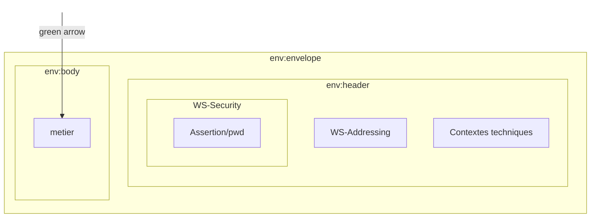

# **« body métier»**

```mermaid
graph TD
    subgraph env_envelope ["env:envelope"]
        direction TB
        subgraph env_header ["env:header"]
            direction TB
            WS_Addressing["WS-Addressing"]
            subgraph WS_Security ["WS-Security"]
                Assertion_pwd["Assertion/pwd"]
            end
            Contextes_techniques["Contextes techniques"]
        end
        subgraph env_body ["env:body"]
            metier["metier"]
        end
    end
    
    Arrow(( )) -- green arrow --> metier
    style Arrow fill:none,stroke:none
```

Présentation de cadre d'interopérabilité
**25** 15/01/2016

