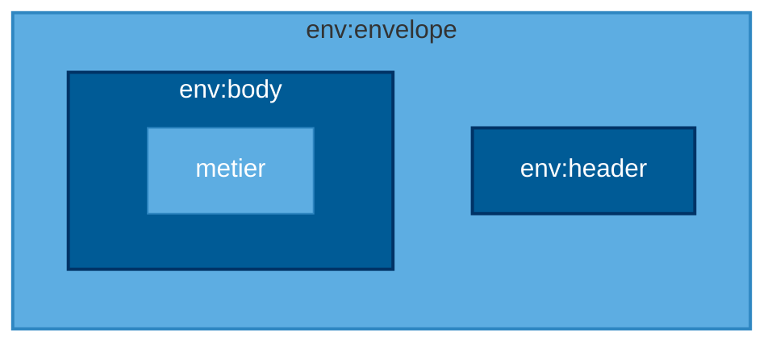

# **Message réponse**

```mermaid
graph TD
    subgraph env_envelope [env:envelope]
        direction TB
        env_header[env:header]
        subgraph env_body [env:body]
            metier[metier]
        end
    end

    style env_envelope fill:#5DADE2,stroke:#2E86C1,stroke-width:2px
    style env_header fill:#005B96,stroke:#003366,stroke-width:2px,color:#FFFFFF
    style env_body fill:#005B96,stroke:#003366,stroke-width:2px,color:#FFFFFF
    style metier fill:#5DADE2,stroke:#2E86C1,stroke-width:1px,color:#FFFFFF
```

Présentation de cadre d'interopérabilité
**26** 15/01/2016

